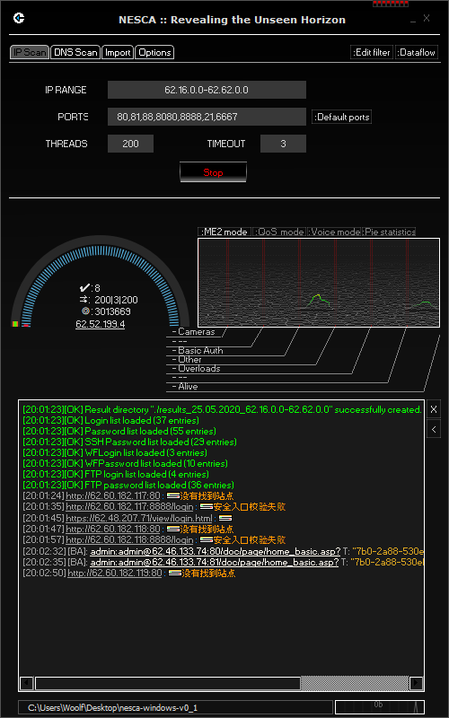

# Nesca

Сканер сети. Легендарный. Твой.



### История возникновения

Был разработан нетсталкерской группой ISKOPASI как универсальный сканер для всего сущего^W Интернета, брута, отсева и собирания базы находочек. База находок ныне мертва, группа тоже.

### Бинарники

[Последние релизы](https://github.com/S0Ulle33/nesca/releases)

[Билд win32 старой версии 24D87-801](https://mega.nz/#!yZV3UDpY!6D5k-Dd1amF0i_rzIhFM-WU7cdN3pxR2mwsYiIqedtU), пароль - 24D87-801

### Аудит безопасности

Пользователем [enemy-submarine](https://github.com/enemy-submarine) был проведет [частичный аудит](https://github.com/enemy-submarine/nesca_audit), который показывает пару уязвимостей (PoC в комплекте) и состояние кодовой базы проекта в целом.

### Самостоятельная сборка

#### Windows

1. Качаем последнюю версию [qt-opensource-windows-x86](http://download.qt.io/official_releases/qt/)
2. Устанавливаем, оставляя галочки на:

   _MinGW 32-bit_  
   _Sources_  
   _QT Creator_

3. Добавляем в PATH следующие папки:

   `C:\Qt\Qt5.14.2\5.14.2\mingw73_32\bin`  
   `C:\Qt\Qt5.14.2\Tools\mingw730_32\bin`

4. `git clone https://github.com/S0Ulle33/nesca.git`
5. Запускаем _QT Creator_ и открываем скачанный репозиторий, выбрав `nesca.pro`
6. Выбираем _MinGW_ и нажимаем _Configure Project_
7. В _QT Creator_, в левом нижнем углу, вместо _Debug_ выбираем _Release_
8. Нажимаем кнопку _Build_ (молоточек)
9. Когда сборка завершится, в папке с репозиторием будет новая папка `build-nesca-Desktop...`; переходим туда и копируем `nesca.exe` из папки `release` в удобное место
10. Открываем _PowerShell_ или _CMD_ из этого места и выполняем:

    `windeployqt.exe --compiler-runtime nesca.exe`

11. Копируем в эту же папку _.dll_ файлы из `репозиторий/src/3rdparty`; и папку `репозиторий/src/pwd_lists`

#### Linux

1. [Официальный дистрибутив Qt5](https://wiki.qt.io/Install_Qt_5_on_Ubuntu)
2. Пакеты зависимостей:

```
sudo apt-get install qtmultimedia5-dev libqt5multimediawidgets5 libqt5multimedia5-plugins libqt5multimedia5 libssh-dev
```

3. Сборка:

```
git clone https://github.com/S0Ulle33/nesca.git
qmake
make
```

### Сборка с помощью Docker

Можно сбилдить с помощью контейнера на основе Ubuntu 14.04, достаточно одной команды в директории с репозиторием:

```
docker build .
```

Для запуска Nesca прямо из контейнера выполнить:

```
docker run -i -e DISPLAY=$DISPLAY -v /tmp/.X11-unix/:/tmp/.X11-unix <IMAGE ID>
```
